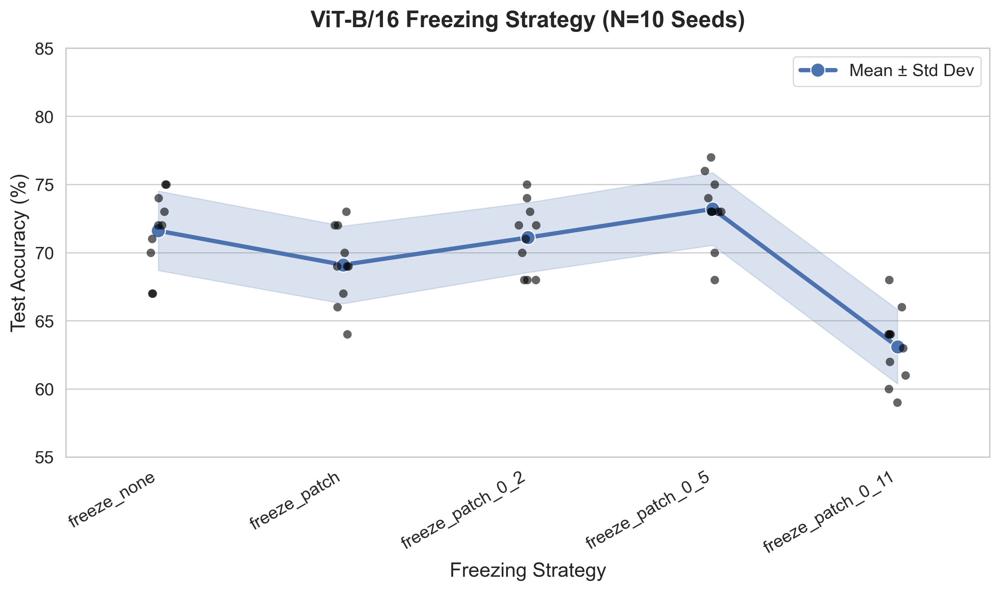

# Transfer Learning Dynamics: Freezing Strategies for Audio Classification
**Systematic comparison: Exploring ViT-B/16 transfer alternative freezing strategies for music spectrograms.**

   

## ABSTRACT
This repository contains the codebase and experimental results for a study investigating the transferability of ImageNet-pretrained Vision Transformers (`ViT-B/16`) to the domain of audio classification (GTZAN dataset). 

Contrary to standard practices in Convolutional Neural Networks (CNNs) where freezing early layers is monotonic in effect, our large-scale evaluation (**N=10 random seeds**) reveals a non-monotonic **"dip-and-recover"** phenomenon in Transformers. While partial freezing generally degrades performance, we observe a statistically significant recovery in accuracy when freezing the first 50% of the network, suggesting distinct feature adaptation dynamics in attention-based architectures compared to CNNs.

## KEY FINDINGS

We evaluated five distinct freezing configurations. The aggregated results (Mean ± Std Dev) indicate:

| Freezing Strategy | Description | Performance Trend |
| :--- | :--- | :--- |
| **Freeze None** | Full Fine-Tuning (All parameters trainable) | Solid Baseline (~71.6%) |
| **Freeze Patch** | Freezing only Embeddings + Positional Encoding | **Performance Dip (~69.1%)** |
| **Freeze 0.2** | Freezing first 20% of Encoder Blocks | Recovery (~71.1%) |
| **Freeze 0.5** | Freezing first 50% of Encoder Blocks | **Highest Accuracy (~73.2%)** |
| **Freeze 0.9** | Freezing ~90% (Classifier only) | Performance Collapse (~63.1%) |



## REPOSITORY STRUCTURE
```bash
transfer-freezing/
├── analysis/           # Scripts for statistical aggregation and plotting (N=10)
├── outputs/            # Logs, checkpoints, and generated figures
├── scripts/            # Core model definitions and data processing modules
│   ├── models.py       # Custom ViT and ResNet wrappers with partial freezing logic
│   └── dataset.py      # GTZAN loading and stratified splitting
├── config.yaml         # Centralized hyperparameter configuration
├── train.py            # Main training loop with seed control
├── run_experiments.sh  # Shell script for batch execution across seeds
├── requirements.txt    # Python dependencies
└── README.md           # Project documentation
```

## METHODOLOGY

### 1. Data Preprocessing
Audio samples are transformed into visual representations to leverage computer vision architectures:
*   **Transformation:** Log-Mel Spectrograms (128 Mel bands, 224x224 resolution).
*   **Normalization:** Per-sample **Min-Max Normalization** to the $$ range.[1]
*   **Augmentation:** No augmentation applied during validation/testing to ensure consistent evaluation.

### 2. Model Architecture
*   **Backbone:** `ViT-B/16` (Pretrained on ImageNet-1k).
*   **Modifications:** The classification head is replaced to match the GTZAN classes (10 genres).
*   **Input Adaptation:** 1-channel spectrograms are replicated to 3 channels to satisfy pre-trained weight dimensions.

### 3. Experimental Setup
*   **Optimizer:** SGD (Learning Rate: $1e^{-4}$, Momentum: $0.9$).
*   **Regularization:** Weight Decay: $0.0$, Dropout: Default pretrained configuration.
*   **Robustness:** All experiments are repeated across **10 random seeds** to verify statistical significance.
*   **NOTE::** None of the experiments included data augmentation so far.


## RUNNING:

### PREREQUISTIES
Ensure you have Python 3.8+ and PyTorch installed.

```bash
pip install -r requirements.txt
```

### REPRODUCTION
To reproduce the full N=10 study, use the provided shell script:

```bash
# Make script executable
chmod +x run_experiments.sh

# Run batch experiments
./run_experiments.sh
```

To run a single specific configuration (e.g., Seed 42, Freeze 50%):
```bash
python train.py --model vit_b_16 --freeze_mode freeze_patch_0_5 --seed 42 --config config.yaml
```

## VISUALIZATION
To generate the summary plots after training is complete:

```bash
python analysis/plot.py
```
This will output the `vit_freezing_analysis_n10.png` figure visualizing the mean accuracy and standard deviation bands.


*Research focus: Deep Learning, Audio Signal Processing, and Transfer Learning Dynamics.*
